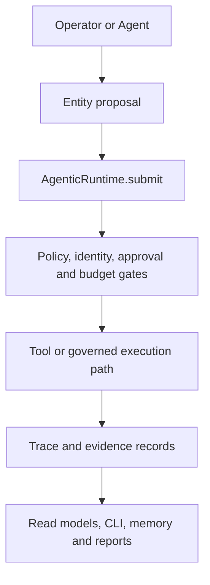
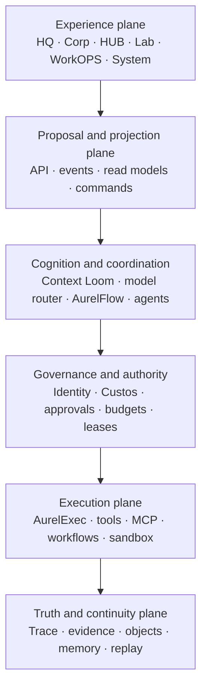
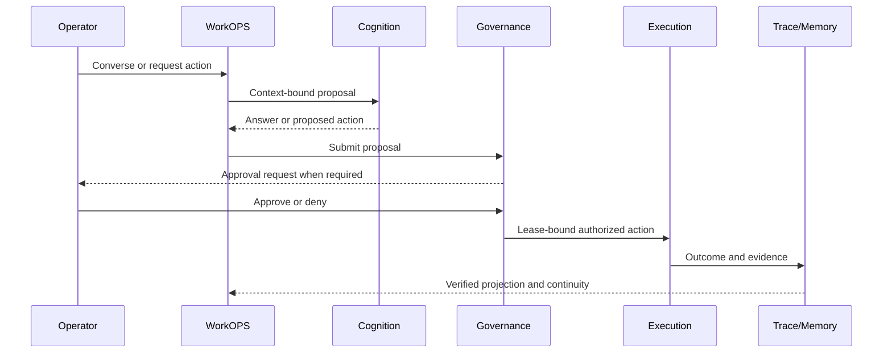

# Aurel — Current → Potential System Design

**Status:** PROPOSED / NON-CANONICAL  
**Artifact type:** System design and transformation map  
**Evidence date:** 2026-07-11  
**Repository:** `HrvojeBudic/Aurel`  
**Purpose:** Explain what Aurel demonstrably is now, what it can become, and the smallest credible architecture bridge between those states.

---

## 1. Executive thesis

Aurel is not currently a finished cognitive operating system. It is a highly governed, contract-rich agentic runtime with a large tested control-plane foundation, several emerging live capabilities, and a product architecture that is ahead of its integrated product reality.

Its strongest achievement is not feature breadth. It is the attempt to make unsafe or unsupported claims structurally difficult: proposals are separated from execution, policy is separated from authority, trace integrity is separated from semantic truth, and unavailable capabilities are represented explicitly.

Its greatest risk is no longer missing architecture. It is **truth fragmentation**:

- roadmap state, architecture state, active-task state, remote `master`, and unpushed feature branches describe different moments;
- contract-scope seals can be mistaken for product completion;
- multiple surface taxonomies coexist;
- significant recent work is described in repository documents as local, unmerged, or unpushed and therefore cannot be treated as remotely verified product truth.

The correct transformation is not “add every planned subsystem.” It is:

> **Collapse Aurel’s proven components into one live, governed, operator-visible loop before expanding breadth.**

The recommended first product proof is:

> **Conversation → Proposal → Approval → Governed Action → Trace → Memory → Operator-visible result**

That loop converts Aurel from an architecture project into an operating product without discarding its constitutional strengths.

---

## 2. Evidence model: what “Current” means

Aurel needs three distinct truth tiers. They must never be collapsed.

| Tier | Meaning | Current use |
|---|---|---|
| **T1 — Remote verified** | Present on accessible GitHub `master` and supported by repository evidence | Safe basis for architectural claims |
| **T2 — Locally reported** | Described by `STATE.md` or `ACTIVE_TASK.md` as implemented on local/unpushed branches | Candidate capability; must be pushed, diffed, merged, and revalidated |
| **T3 — Canonical potential** | Defined by roadmap, IA, design doctrine, or handoff contract | Direction and constraint; not implementation |

### Current evidence conflict

The remote documents do not describe one synchronized checkpoint:

- `ROADMAP.md` identifies P4 as the last completed pack and P5 as next.
- `ARCHITECTURE.md` contains a P5 sealed architecture map and identifies P6 as next.
- `STATE.md` records later Track A memory work, provider/secrets work, and local merge state, including work explicitly described as not pushed.
- `ACTIVE_TASK.md` records later F4B/F5 work, including MCP client integration, a conversational front server, approval inbox, and feature branches not merged or pushed.
- `CANON_INDEX.md` itself warns that some progress mirrors lag repository truth.

Therefore, this document treats late branch work as **emerging but unverified on the accessible remote**, not as established production state.

---

## 3. Current system map

### 3.1 What exists as a coherent foundation

Aurel already has a recognizable governed runtime architecture:

| Domain | Current architectural reality |
|---|---|
| **Entity** | `AgenticEntity` proposes plans and commands; it is not the execution authority |
| **Runtime kernel** | `AgenticRuntime.submit()` is the main governed command entry point |
| **Policy and identity** | Typed policy, identity, consent, risk, capability, and lifecycle structures; enforcement maturity varies by path |
| **Execution** | AurelExec admission, leases, attempts, bounded runtime submit bridge, failure classification, recovery plans, and execution projections |
| **Workflow** | AurelFlow provides workflow/control-plane grammar and handoff structures; much of it is intentionally non-executing |
| **Trace and evidence** | Hash-chained trace foundations, verification receipts, evidence refs, query/read models, and explicit distinction between integrity and semantic truth |
| **Memory** | Multi-tier memory foundations; later state files report durable memory, graph, revision, consolidation, hybrid retrieval, and runtime wiring on local work |
| **Tools and integrations** | Tool Bus and manifests; later state files report outbound MCP client/bridge work and governed external-tool ingestion |
| **Models** | Provider routing and configuration foundations; later state files report OpenAI-compatible adapters, secrets, redaction, and model-swap drills |
| **Shell/product contracts** | Extensive surface, navigation, window, command, handoff, projection, CLI, and multi-client contracts; many remain contract-only |
| **Quality discipline** | Large automated test suites, deterministic models, truth labels, unavailable-state declarations, and exit-seal patterns |

### 3.2 Current logical topology



This is Aurel’s real architectural spine. The product must converge on it instead of creating alternate action paths.

### 3.3 Current strengths

1. **Governance is architectural, not decorative.**  
   Aurel repeatedly separates intent, eligibility, authorization, execution, verification, and evidence.

2. **Truth labels are unusually disciplined.**  
   `LIVE`, `TRACE_VERIFIED`, `DEV_FIXTURE`, `UNAVAILABLE`, and related states are treated as claims with conditions.

3. **The system is designed to fail closed.**  
   Unknown schemas, unavailable integrations, missing authority, and unsupported execution modes are generally represented explicitly.

4. **The runtime has a plausible single-door principle.**  
   The entity proposes; the runtime disposes. Later F5 work extends the same principle into conversational `ANSWER / PROPOSE / ACT` semantics.

5. **The implementation has meaningful evidence density.**  
   Reports, tests, hashes, seal checks, capability matrices, and side-effect proofs create a stronger base than a UI-first prototype would.

### 3.4 Current limitations

| Limitation | Consequence |
|---|---|
| **Remote/local state divergence** | The actual recoverable product state is uncertain |
| **Roadmap and architecture drift** | “Next task” and “completed domain” are not singular truths |
| **Contract-to-product gap** | Many surfaces are modeled but not operator-usable |
| **Surface taxonomy collision** | Seven-surface Shell canon and six-screen Product IA do not map cleanly |
| **Local/in-process substrates** | Queue, worker, approval inbox, memory, and server paths are not yet production durability |
| **Partial enforcement** | Some policy and identity structures remain shadow, projection, or path-dependent |
| **No sealed end-to-end product loop** | Components exist, but the full operator experience is not yet the primary proof |
| **Deployment and recovery weakness** | Repository notes include unpushed branches and a filesystem-loss incident |
| **Potential duplicate truth concepts** | Trace ledger, canonical trace contract, state files, reports, and memory need explicit ownership |
| **Vision breadth** | The roadmap can absorb effort faster than integration can convert it into product value |

---

## 4. Product taxonomy reconciliation

Two product maps currently coexist.

### Seven-surface Shell canon

- Aurel CRO
- HQ
- CORP
- HUB
- IDE
- SYSTEM
- Settings

### Six-screen Product IA

- HQ
- Corp
- HUB
- Lab
- WorkOPS
- System

These should not remain competing root taxonomies.

### Recommended canonical resolution

| Canonical product element | Resolution |
|---|---|
| **HQ** | Primary command, intelligence, collaboration, and global operator surface |
| **Corp** | Business environments, operations, finance, simulation, and R&D |
| **HUB** | Tool, skill, workflow, automation, media, and artifact creation |
| **Lab** | Dedicated model, dataset, evaluation, and AI experimentation surface |
| **WorkOPS** | Human-agent work surface; absorbs IDE as `WorkOPS.Code` |
| **System** | Admin-only platform control plane |
| **Settings** | Global utility route, not a primary operating surface |
| **AurelEU / Aurel CRO** | Governed actor/role projection available across surfaces, not a peer screen |

This yields six durable product surfaces, one global utility layer, and one role-fluid sovereign actor. It preserves both canons without pretending they are identical.

---

## 5. Potential system: Aurel as a Governed Agentic Cognitive OS

The target is a single durable runtime projected through multiple operator surfaces.

### 5.1 Target architecture planes



### 5.2 Plane responsibilities

#### Experience plane

The six product surfaces render governed projections. They do not own canonical business or runtime state.

Every consequential object should expose:

- truth label;
- source and provenance;
- authority and approval state;
- trace/evidence link;
- memory/object references;
- available actions and unavailable reasons.

#### Proposal and projection plane

This is the only interface between clients and the runtime.

It should provide:

- versioned command/proposal envelopes;
- read-only projections;
- event subscriptions;
- idempotency keys;
- capability-aware client profiles;
- explicit degraded/unavailable behavior;
- no direct client-to-tool path.

#### Cognition and coordination plane

This plane interprets intent and creates candidate plans. It does not grant authority.

Core responsibilities:

- context assembly and source labeling;
- model routing and budget-aware inference;
- task/intent classification;
- AurelFlow plan and workflow construction;
- multi-agent coordination;
- simulation and recommendation;
- clear separation of generated proposal from approved action.

#### Governance and authority plane

This plane decides whether an action may proceed.

Core responsibilities:

- actor identity and lifecycle;
- capability and delegation resolution;
- policy-card evaluation;
- consent and human approval;
- risk classification;
- budget and resource limits;
- execution lease issuance;
- country/legislation context;
- deny-by-default handling for ambiguous authority.

#### Execution plane

This plane performs side effects through one governed door.

Core responsibilities:

- lease-bound AurelExec jobs;
- tool and MCP invocation;
- sandboxed code/terminal operations;
- deterministic workflow steps;
- retries, compensation, checkpoints, and backpressure;
- external API and model invocation;
- outcome normalization without equating runtime success with semantic success.

#### Truth and continuity plane

This plane makes the system inspectable and recoverable.

Core responsibilities:

- canonical append-only trace;
- trace-integrity and semantic-verification separation;
- evidence receipts and output passports;
- durable object/state plane;
- governed memory lifecycle;
- replay and time-slice analysis;
- causal Golden Thread;
- projections rebuilt from canonical events where feasible.

---

## 6. Golden product loop

The first complete Aurel product should prove one loop, not six partially live screens.



### Required invariant

There must be exactly one mutation path:

```text
Client intent
  → ProposalEnvelope
  → policy / identity / approval / budget
  → ExecutionLease
  → AgenticRuntime / AurelExec
  → tool or workflow
  → trace and evidence
  → projection and memory
```

No UI, agent, MCP server, workflow, or model may bypass this chain.

---

## 7. Current → Potential capability matrix

| Axis | Current | Potential | Bridge proof |
|---|---|---|---|
| **Interaction** | CLI, contract projections, emerging conversational server | Unified conversational and graphical operator shell | One WorkOPS room completing the Golden product loop |
| **Execution** | Governed runtime and bounded local execution | Durable workflow execution with recovery and backpressure | Lease-bound action with idempotency, checkpoint, and evidence |
| **Governance** | Strong typed contracts; mixed shadow/live enforcement | Uniform Custos enforcement on every mutation path | Bypass audit shows zero alternate execution doors |
| **Trace** | Hash-chain and verification architecture | Durable causal evidence spine and replay | Restore operator-visible run state from canonical trace |
| **Memory** | Foundation plus locally reported durable/graph/retrieval work | Governed bitemporal memory and object continuity | Remember, revise, retrieve, forget, and explain provenance |
| **Models** | Router/config foundations and locally reported providers | Policy-aware multi-model routing with cost/quality evidence | Deterministic model-swap drill and budget attribution |
| **Tools** | Tool Bus; locally reported outbound MCP bridge | Governed tool/plugin ecosystem | External tool result remains tainted and evidence-bound |
| **Product surfaces** | Extensive contracts; limited live product | Six integrated surfaces over one runtime | Surface parity test over shared read model |
| **Deployment** | Local development and branch fragility | Reproducible build, backup, migration, and recovery | Fresh-machine restore and green seal |
| **Autonomy** | Proposal-oriented, operator-heavy | Bounded manual/semi/auto modes with revocable authority | Same task demonstrated across authority modes |

---

## 8. Transformation architecture

### Gate 0 — Reality seal

Before new feature work:

1. Push or archive every valuable local branch.
2. Identify the actual authoritative commit.
3. Diff `master` against Track A, F2, F4B, and F5 work.
4. Reconcile `ROADMAP.md`, `ARCHITECTURE.md`, `STATE.md`, `ACTIVE_TASK.md`, and `CANON_INDEX.md`.
5. Produce one machine-readable capability manifest:
   - implemented;
   - merged;
   - remotely present;
   - tested;
   - live;
   - trace verified;
   - unavailable;
   - planned.
6. Resolve the surface taxonomy.
7. Run the full validation seal on the reconciled state.

**Exit criterion:** one commit, one current-state pointer, one next task, zero unbacked completion claims.

### Gate 1 — Operator loop seal

Integrate only the components needed for the Golden product loop:

- F5 conversational entry;
- context assembly;
- answer/propose/act classifier;
- approval inbox;
- runtime submit;
- one safe internal tool;
- one governed MCP tool;
- trace/evidence projection;
- governed memory write and retrieval;
- minimal WorkOPS interface.

**Exit criterion:** an operator can request an action, review it, approve it, observe execution, inspect evidence, and resume with memory after restart.

### Gate 2 — Product foundation

- Canonical six-surface registry.
- Shared navigation and working-set state.
- Versioned projection API and event stream.
- Authentication/session boundary.
- Client capability/degradation profiles.
- Web first; desktop/mobile/terminal as projections, not forks.
- Uniform truth/evidence/approval components.

**Exit criterion:** HQ and WorkOPS use the same runtime state with no duplicated operational truth.

### Gate 3 — Durable governed autonomy

- Durable workflow queue and worker model.
- Replay-safe idempotency.
- Checkpoint and compensation.
- Full Custos enforcement.
- Durable trace/object/memory coupling.
- Delegation, capability revocation, and budget control.
- Manual, semi, and auto modes using the same execution path.

**Exit criterion:** bounded autonomous work survives process restart without losing authority, evidence, or continuity.

### Gate 4 — Cognitive OS expansion

Only after the prior gates:

- Corp business environments;
- HUB skill/workflow/media creation;
- Lab experiments and model lifecycle;
- multi-agent councils and societies;
- distributed/hybrid execution;
- adaptive evaluation and evolution;
- legislation-aware AurelEU role dispatch;
- eventual civilization/federation layers.

**Exit criterion:** new domains reuse the established loop and do not create parallel runtimes.

---

## 9. Key architectural decisions

### AD-01 — One mutation door

All consequential actions pass through the governed runtime submit path. Direct tool, model, workflow, shell, or MCP execution from product clients is forbidden.

### AD-02 — Trace is evidence spine, not semantic truth

Hash integrity proves record integrity. Semantic verification requires explicit verifier evidence. Product language must preserve this distinction.

### AD-03 — AurelEU is an actor, not a database or screen

AurelEU may orchestrate roles and agents, but canonical state remains in trace/object/memory systems and authority remains governed.

### AD-04 — Product surfaces are projections

HQ, Corp, HUB, Lab, WorkOPS, and System consume versioned read models and proposal APIs. They never become independent sources of operational truth.

### AD-05 — Manual, semi, and auto are authority profiles

They are not separate runtimes. The same proposal, governance, execution, trace, and memory chain applies; only approval and delegation policy changes.

### AD-06 — Unavailable is a first-class state

A missing capability must carry a reason, owner, prerequisite, and next action. It must not silently fall back to a simulated or weaker path.

### AD-07 — Roadmap completion is not product completion

A contract-scope seal closes a defined architecture boundary. Product completion requires a live operator path, persistence, enforcement, evidence, and recovery.

---

## 10. Non-goals for the first product proof

The first proof should not attempt:

- distributed multi-node execution;
- a complete six-screen UI;
- autonomous business operation;
- full Lab/model training;
- civilization-scale agent societies;
- production compliance certification;
- Rust/WASM runtime replacement;
- cross-world federation;
- broad marketplace or plugin ecosystem.

These are valid future directions. They are not prerequisites for proving Aurel’s core hypothesis.

---

## 11. Primary risks and controls

| Risk | Control |
|---|---|
| Architecture expands faster than integration | Gate new domains behind the Golden product loop |
| Local work is lost or unverifiable | Remote branch backup, protected merge flow, fresh-clone seal |
| Contract seals create false confidence | Separate contract, integration, live, recovery, and production seals |
| Multiple state authorities emerge | Publish a source-of-truth ownership matrix |
| UI bypasses governance | One proposal endpoint; zero direct mutation clients |
| Agents self-elevate authority | Identity-derived least privilege and revocable leases |
| External content becomes instruction | Taint, provenance, context fencing, and sink isolation |
| Memory becomes ungoverned truth | Candidate-first writes, evidence links, revision history, and forget semantics |
| Surface taxonomy keeps drifting | Council-lock the six surfaces plus utilities/actor mapping |
| “Autonomy” hides operator loss of control | Same runtime across modes; visible policy and immediate revocation |

---

## 12. Success definition

Aurel has crossed from **Current** to its first credible **Potential** when all of the following are true:

- one remotely backed-up, reproducible repository state exists;
- one canonical current-state document identifies the active commit and next task;
- the six-surface taxonomy is locked;
- WorkOPS completes the Golden product loop;
- approval, denial, and unavailable paths are operator-visible;
- every executed action has trace and evidence;
- memory continuity survives restart;
- an external MCP tool can be used without turning external content into trusted instruction;
- the same action can run in manual and semi mode through the same runtime;
- a fresh machine can restore, run, validate, and demonstrate the system;
- no product surface owns a parallel mutation path or duplicate operational truth.

---

## 13. Best next move

Do not begin another broad roadmap domain.

Execute a **Reality Seal + Operator Loop Integration Pack**:

1. recover and push all valuable feature branches;
2. establish the authoritative integration branch;
3. reconcile current-state documents;
4. merge only the minimum F2 + Track A + F4B + F5 components required by the Golden loop;
5. build the smallest WorkOPS interface over that loop;
6. validate approval, denial, unavailable, tool, trace, memory, restart, and recovery paths;
7. seal the result as **OPERATOR_LOOP_LIVE**, without claiming full Aurel product completion.

That pack is the shortest path from “Aurel has an architecture” to “Aurel is an operating system someone can actually operate.”
